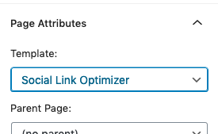
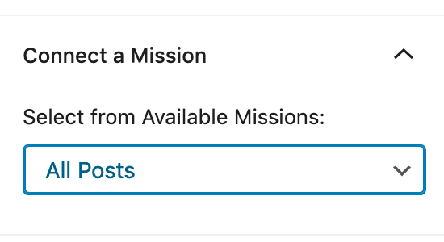

# Social Link Optimizer

This plugin seeks to resolve an problem presented by by Instagram's decision to disallow users from adding links to individual posts. this design choice prevents users from adding additional context to their posts. As a result, many Instagram users create customized landing pages with the additional context that would like to convey, and use the link to this landing page as the solitary link in their bio.

This plugin allows for WordPress users to easily create such landing pages where users can and populate them with a list of links/grid of linked images.

## Installation

### Basic

To install this plugin, you can copy the files into the plugins directory of your WordPress install. An easy way to do this is to clone the repository from GitHub:

```bash
$ cd my-site/wp-content/plugins
$ git clone https://github.com/IIP-Design/social-link-optimizer.git
```

### Composer

If using a Composer build process, add a reference to the plugin's git repository to the repositories array of your `composer.json`. In the require section, add an entry for `gpalab/social-link-optimizer` pointing to the version of the plugin you would like to use. Your resulting `composer.json` file will look something like this:

```json
{
  "name": "sample-webroot",
  "repositories": [
    {
      "type": "git",
      "url": "git@github.com:IIP-Design/social-link-optimizer"
    },
    ...(other repos)
  ],
  "require": {
    "gpalab/social-link-optimizer": "*",
    ...(other dependencies)
  }
}
```

## Features

### Plugin Settings Page

Found under the **Social Links > Settings** sub-menu in the admin menu, this page is used to configure the plugin. Specifically, it allows users to create mission-based groupings for their social links.

Clicking the `Add Mission` button will create a new mission grouping to which social links can be assigned. Each mission has several properties:

- Name: The name of the mission
- Website: The URL of the mission's homepage
- Display links as: A radio button group to set the determine the layout for the social links landing page (either a grid of images or a list of links)
- Profile links: A series of text fields where one can set the URL for the mission's various social media properties

Click `Save Changes` to update the changes to the missions.

To delete an existing mission, navigate to the appropriate tab in the settings page and click on the `Remove This Mission` button.

### Social Link Custom Post Type

Social link posts are the individual items that populate the social link landing pages. To add a new social link, navigate to **Social Links > Add New** in the admin menu. To see all existing social links go to **Social Links > All Links** sub-menu in the admin menu.

Each social link item type has several properties, namely:

- Title: This is how the link will be referenced in the list of all social link items. Additionally, in the list view, this is the text that appears with the link.
- Link: This is the URL that users will be directed to when clicking on this social link item.
- Featured Image: This attaches an image to the given social link. When in the grid view, this is the image that appears for the given social link item.
- Mission: This property associates a given social link with one of the missions added in the settings page. This is used to group a collection of links together.
- Archive: This property can be toggled when you want to remove a particular social link from the collection of links. It will remove the link from the corresponding mission page without deleting the link entirely.

### Social Link Optimizer Page Template

The plugin also adds a custom page template that displays a group of social link items as a landing page. This template will appear as an option under the **Template** dropdown in the **Page Attributes** metabox in the page editor sidebar.



Once the `Social Link Optimizer` option is selected in the template dropdown, a new metabox called **Connect a Mission** will appear in the editor sidebar.



From this dropdown you can associate the page with one of the missions added in the settings page. With this done, the front end of the page will automatically display the grid/list of links that have been tagged with the corresponding mission.
