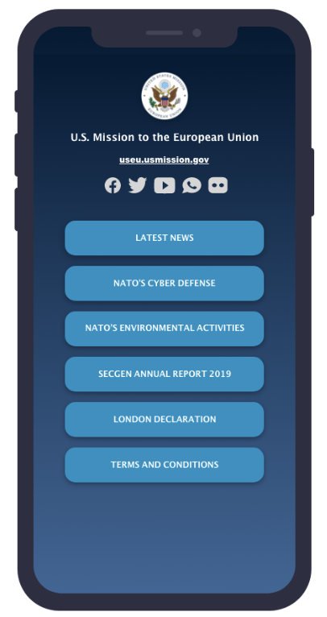
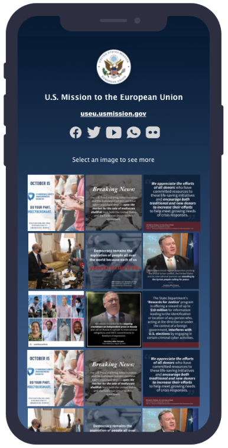

Social Links is a WordPress plugin designed and developed by the [GPA Digital Lab](https://lab.america.gov/) as an alternative to third-party platforms such as [linkin.bio](https://later.com/free-link-in-bio/) and [LinkTree](https://linktr.ee/). While great products, these platforms raise the following concerns when used by post:

1. As third-party cloud products, questions often arise about FedRAMP status or security implication of using these services. Even when there is no security concern, such questions can impose complications and burdensome paperwork for users. By deploying this plugin on the Mission Websites Platform, the resulting pages inherit the security of the underlying platform and ensure data is stored in a safe and secure fashion.
1. Third-party services often have a cost associated with them. Beyond the simple dollar amount needed to acquire the product, recurring subscriptions are often perversely difficult to get through the acquisitions process. This plugin, on the other hand, was developed and open sourced by the Department making it free to use for all.
1. As U.S. Department of State properties, mission web assets should utilize a consistent branding and style. This is often difficult to achieve with third-party tools. Meanwhile, Social Links applies the Department styles out of the box and ensures consistency across all post's social links pages. Furthermore, special care was taken to ensure that the end product follows accessibility best practices so that your content is available to all users.

## What This Plugin Provides

Driving user traffic from social media to key web content is a cornerstone of any organization’s content strategy. This is often accomplished by means of a landing page that aggregates links.

The easy-to-use Social Links plugin was [created with Mission personnel in mind](https://lab.america.gov/2021/06/23/introducing-social-links/) and developed in collaboration with staff in the field. It provides an administrative interface with a post's mission website to create "mission" pages where you will be able to add your links. Each WordPress instance can have multiple social link pages. The plugin also adds a "social link" custom post type to your site, which can be used to populate the social link pages.

Among the configuration options is a choice of two layouts, a list view and a grid view:

As seen above, the list view is a simple column of linked text. The grid view displays three columns of linked images. Other configurable page elements include:

- An image at the top of the page to indicate the mission
- The mission name
- The mission site URL
- Links to the mission social media properties (Twitter, Facebook, YouTube, etc.) as needed

## Further Information

- If you are looking to install this plugin on your WordPress instance, please visit our [installation guide]({{ '/installation' | relative_url }}).
- Please see the [guide for web managers]({{ '/admin-user-guide' | relative_url }}) for instructions on setting up a new social links landing page using this plugin. If you already have a landing page set up, the [guide for social media managers]({{ 'user-guide' | relative_url }}) will guide you through the process of managing the links on your page.
- If you would like to contribute to this project, please review the [technical documentation]({{ '/technical' | relative_url }}) and submit a pull request on our [GitHub repository](https://github.com/IIP-Design/social-link-optimizer).
