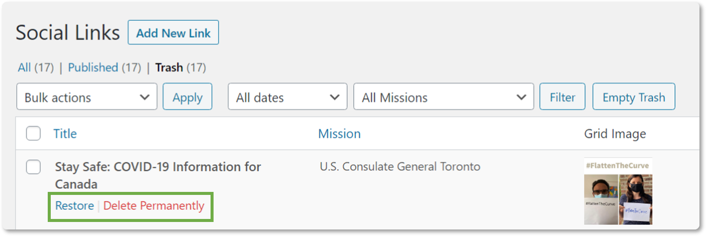
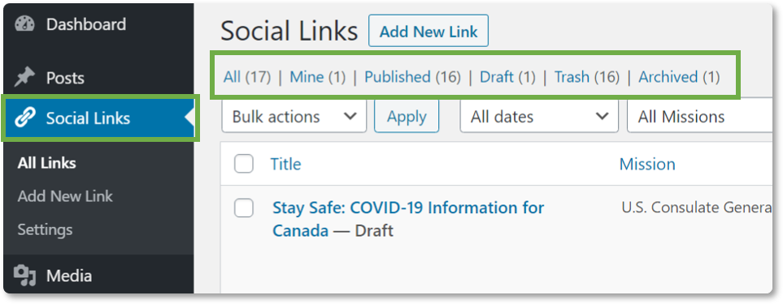

### Navigate to the Social Links Plugin

1. Within your WordPress instance, navigate to the left side menu panel.

2. Hover over **Social Links** to view the quick navigation options or click on **Social Links** to go to the main menu.

### Use the Dashboard Widget to Set Preferences

1. Click **Dashboard** on the left side menu to navigate to the **Social Links** dashboard widget.

2. Select a **Mission** from the drop-down menu to set a default mission view.

3. Click the **Set Default View** button. Your preferences are saved.

4. Click the **Go to my Social Links page** link to access your default view.

> **Note**: You will only be able to access the default view through the link in the Social Links dashboard widget.

### Create a New Link Post 

1. On the left side menu panel, click on **Social Links**.

> **Note**: To add a new link from the homescreen, hover over the **Social Links** icon and click the **Add New Link** menu option.

2. Click the **Add New Link** button at the top of the page. The **Add New Social Link** page will appear.

3. Insert a title for the link in the first box on the page. This is a required field. If the field is not populated, you will receive an error message with instructions. All required fields must be populated in order to publish the post.

4. Insert the URL in the **Add a Link to This Social Post** box. This is a required field.  If the field is not populated, you will receive an error message with instructions. All required fields must be populated in order to publish the post.

5. Select a **Mission** from the drop-down menu in the **Select Mission** box. This is a required field.  If the field is not populated, you will receive an error message with instructions. All required fields must be populated in order to publish the post.

  > **Note:** You will still need to make a Mission selection even if there is only one Mission option in the drop-down menu.
  >
  >If you are using the Vertical List template, skip step 6. If you are using the Three Column Grid template, continue with step 6.

6. Click the **Add an image to the grid** link in the **Add a Grid Image** box. The **Media Library** pop-up will appear.

7. Select a file from the **Media Library** or click the **Upload files** tab. 

8. Click the **Select Files** button to search for an image in your files or drag and drop an image to upload. 

9. Your image will appear in the **Media Library**. Select the image. Add alternative text in the **Alt Text** box for accessibility. Alternative text refers to the invisible description of images which are read aloud to visually impaired users on a screen reader.

10. Click the **Add an image** to the grid button. You will be taken back to the **Add New Social Link** page and the selected image will appear in the **Add a Grid Image** box.

> **Note**: If you selected the image in error, click the **Remove image** link.

11. In the **Publish** box, click the **Save Draft** button to save the post as a draft or click the **Preview** button to preview the post on its Social Link page before publishing.

12. Click the **Publish** button to publish the post. A message will appear at the top of the screen confirming the post has been published.

13. To view the post on the live Social Links page, click the link in the **Select Mission (required)** box. A new tab will open with the live, external Social Links page.

> **Note**: If you would like to schedule the publish time and date of the post, click on the **Edit** link for the **Publish immediately** option and select a date and time. Click the **Ok** button, then click the **Schedule** button.

14. To view published posts, navigate to the **Social Links** main menu. Click the **Published** link at the top of the page. A list of the published posts will appear and are sorted by published date. The default **All** view will also show the published links.

### Edit Existing Posts

1. On the left side menu panel, click on **Social Links**.

2. Hover over the post that you want to edit. Either click the **Edit** link or click on the post title and the **Edit Social Link** page will appear.

3. Make the necessary changes. Click the **Preview Changes** button to preview the post before publishing.

4. To change the status of the post, click the **Edit** link and select an option from the drop-down menu. Click the **OK** button.

5. Click the **Update** button to update the post.

> **Note**: If you would like to schedule the publish time and date of the post, click on the **Edit** link for the **Publish immediately** option and select a date and time. Click the **OK** button, then click the **Schedule** button.

### Delete Existing Posts

1. On the left side menu panel, click on **Social Links**.

2. Hover over the post that you want to delete. Click the red **Trash** link to move the post to the trash. A notification will appear at the top of the page that reads: 1 post moved to the Trash. 

> **Note**: If you moved something to the trash in error, you can click the **Undo** link to restore the post. 

### Delete Posts Permanently or Restore Deleted Posts

1. On the left side menu panel, click on **Social Links**.

2. Click on the **Trash** link at the top of the page. 

3. Hover over the post that you want to restore or delete permanently with your mouse. Click on the **Restore** link to restore the post. Click on the **Delete Permanently** link to permanently delete the post (this cannot be undone).

4. If you chose to restore the post, it will now appear in the **Draft** list. Click on the **Draft** link at the top of the page to view the list of draft posts. 

### Archive and Unarchive Posts

1. On the left side menu panel, click on **Social Links**.

2. Hover over the post title that you want to archive. Click the **Archive** link. The title of the post will now have the word **Archived** at the end of it. 

3. To unarchive the post, click the **Edit** link. The **Edit Social Links** page will appear.

4. In the **Publish** box, click the **Edit** link to change the status. 

5. Select **Draft** from the drop-down menu and click the **OK** button.

6. Click the **Save Draft** button to unarchive the post and save as a draft or click the **Publish** button to publish the post. 

### View Posts in Draft, Published, Archived Status

1. On the left side menu panel, click on **Social Links**.

2. Click on the **Published**, **Draft**, or **Archived** links at the top of the page to view the respective posts within each status. 

> **Note:** You can click on the **Mine** link to view posts that you created. Click on the **All** link to view all Social Link posts. Click on the **Trash** link to view posts that are in the trash. 

### Filter Posts

1. On the left side menu panel, click on **Social Links**.

2. To filter by date, click on the **All dates** drop-down menu and select a month. Click the **Filter** button.

3. To filter by Mission, click on the **All Missions** drop-down menu and select a Mission. Click the **Filter** button.

### Perform Bulk Actions

1. On the left side menu panel, click on **Social Links**.

2. Check the checkbox next to the posts that you want to be included in the bulk action.

3. Click on the **Bulk actions** drop-down menu and select a bulk action.

4. Click the **Apply** button.